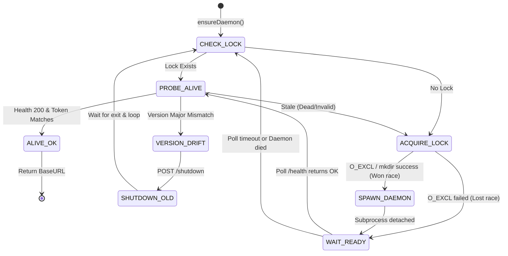

# P3 Daemon 生命周期状态机详设

本设计是对 [`plan.md`](./plan.md) 中 §2（daemon 自启动 / 单例 / 端口发现）的详细展开，为 P3 阶段的核心实现提供精确的算法和状态机约束。它解决了多个 MCP Server 并发冷启动、旧进程残留、版本漂移等复杂竞态问题。

## 1. 核心流程与状态机 (State Machine)

客户端（Agent 调用的 `passtorch` Server）的核心生命周期入口是 `ensureDaemon()`。该函数是一个**自旋状态机**（Spinning State Machine），直到成功获取可用的 BaseURL 或达到全局重试阈值才返回。



## 2. 三段探活算法 (isDaemonAlive)

```typescript
type ProbeResult = 
  | { status: 'ALIVE', url: string, version: string, token: string }
  | { status: 'STALE', reason: string }
  | { status: 'FOREIGN', reason: string }; // 别的用户的进程

async function probeDaemon(lock: LockFile): Promise<ProbeResult> {
  // 1. PID OS 级探活 (快速筛除明显死亡的残留锁)
  try {
    process.kill(lock.pid, 0); // 0 = 仅检查信号发送权限
  } catch (e) {
    if (e.code === 'ESRCH') return { status: 'STALE', reason: 'Process dead' };
    if (e.code === 'EPERM') return { status: 'FOREIGN', reason: 'Owned by another user' };
  }

  // 2. HTTP 健康检查 (应用级探活，防 PID 复用)
  try {
    const res = await fetch(`http://127.0.0.1:${lock.port}/health`, { 
      signal: AbortSignal.timeout(500) 
    });
    if (!res.ok) return { status: 'STALE', reason: 'Health check not 200' };
    
    const body = await res.json();
    if (body.token !== lock.token) {
      // 端口被其他进程占用，或旧 daemon 被新 daemon 顶替但锁没写对
      return { status: 'STALE', reason: 'Token mismatch' };
    }
    
    return { status: 'ALIVE', url: `http://127.0.0.1:${lock.port}`, version: body.version, token: body.token };
  } catch (e) {
    return { status: 'STALE', reason: `Health check failed: ${e.message}` };
  }
}
```

## 3. 原子锁抢占策略 (Atomic Lock Acquisition)

Node.js 在跨平台文件原子操作上存在局限。为防「Server A 误删 Server C 刚建的健康锁」，采用**原子目录抢占 (Directory Lock)** 或 **wx 文件原子创建**。

### 3.1 基于目录的抢占机制

由于 `fs.mkdir` 是跨平台绝对原子的，我们采用建立 `daemon.lock.d` 目录来标识“正在启动”的状态：

1. **抢锁**：`fs.mkdirSync('daemon.lock.d')`
   - 成功：当前 Server 成为 Leader，负责启动 Daemon。
   - 失败 (`EEXIST`)：当前 Server 成为 Follower，进入轮询等待。
2. **清理旧锁**：
   - 只有判断为 `STALE` 的进程，才有资格去抢 `daemon.lock.d`。
   - 抢到 `daemon.lock.d` 的 Leader 负责 `fs.unlinkSync('daemon.lock')` 清理陈旧锁文件，并启动新 Daemon。
3. **Daemon 落锁**：
   - Daemon 启动就绪后，自己原子写入临时文件 `daemon.lock.tmp`，然后 `fs.renameSync('daemon.lock.tmp', 'daemon.lock')`。
   - 写入完成后，Daemon 负责 `fs.rmdirSync('daemon.lock.d')` 释放抢占锁。

## 4. 就绪轮询与退避 (Wait For Ready)

无论是 Leader (刚启动 Daemon) 还是 Follower (抢锁失败)，都会进入 `waitForReady` 循环：

- **退避策略**：50ms, 100ms, 200ms, 400ms, 500ms, 500ms... (封顶 500ms 间隔)
- **超时退出**：总时长超过 8000ms 抛出 `DaemonStartTimeout`。
- **轮询动作**：
  1. 检查 `daemon.lock` 是否存在并且能通过 `isDaemonAlive` 检查。
  2. 若 `isDaemonAlive` 返回 `ALIVE`，轮询成功，返回 BaseURL。
  3. 若 `daemon.lock.d` 已经消失，但依然没看到合法的 `daemon.lock`，说明 Leader 启动 Daemon 失败（闪退），重置循环，回到 `CHECK_LOCK` 重新竞争。

## 5. 版本漂移换代 (Version Drift Handover)

如果当前 Server 的版本为 `0.2.x`，但探活发现 Daemon 是 `0.1.x`（主版本不同），必须执行无缝重启：

1. Server 发送 `POST /shutdown` 到旧 Daemon。
2. Server 开始自旋轮询（Max 3s），等待 `isDaemonAlive` 返回 `STALE`（即进程退出）。
3. 旧 Daemon 退出后，Server 继续执行外层大循环（重新进入 `ACQUIRE_LOCK` 抢占并拉起新版）。
4. **Daemon 侧支持**：Daemon 收到 `/shutdown` 后，必须立刻拒绝新请求（返回 503 Shutting Down），并等待当前正在处理的请求（如大文本 Append）落盘完毕后，删除 `daemon.lock` 并退出。

## 6. Daemon 选端口防冲突

Daemon 不从外部接端口，而是自己向上探测：

```typescript
let port = 9057;
const maxPort = 9077;
while (port <= maxPort) {
  try {
    await listenOn(port, '127.0.0.1');
    break; // 成功
  } catch (e) {
    if (e.code === 'EADDRINUSE') port++;
    else throw e;
  }
}
if (port > maxPort) {
  throw new Error(`All ports 9057-9077 are in use.`);
}
```
结合锁的 Token 校验，即使 9057 被别的无赖进程占用，Daemon 也会绑 9058，并将 9058 写入锁，Server 读取探活时依然完全准确。
